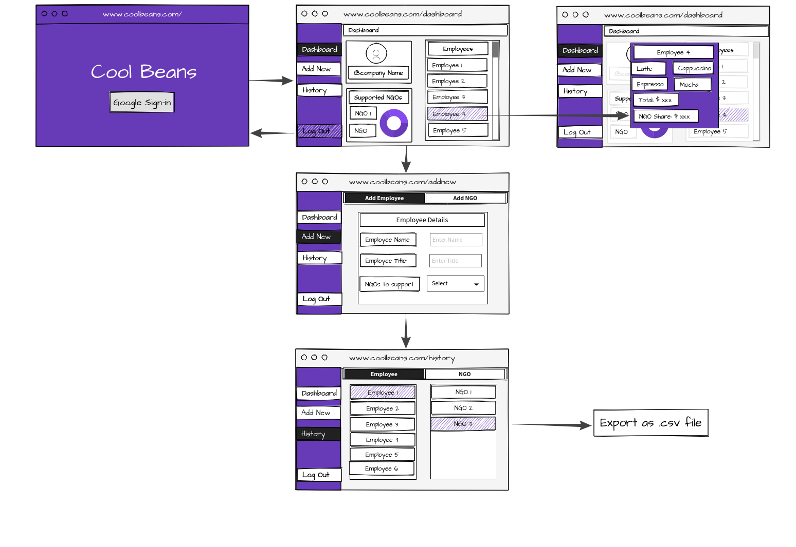

# Cool-Beans

* This app is as cool as it sounds because being caring is cool and as a Melbournian what's more cool than a cup of coffee.

* This app helps you log your coffee count and contribute a portion of it to a good cause.

## Wireframe

## Technologies Used

* MongoDB
* ExpressJS
* ReactJS
* NodeJS

* JWT Token
* Googleapis (NPM module for Google Signin)
* Chartjs
* React-Bootstrap
* js-cookie
* Axios

## Demo

## Live Website

https://cool-beans-coffee.herokuapp.com/

* Create a sign in using Google sign-in.
* Google will help sign-in automatically.
* Acting as an owner of the company, add the NGOs the company supports and the employees that work for your company.
* Add orders for the employees. A share of the purchase is contributed to the NGO.
* Interactive graphs shows contribution to each NGO.
* Capacity to delete and add employees and NGO.

## Role

This app is developed by me, both Front End and Back End.